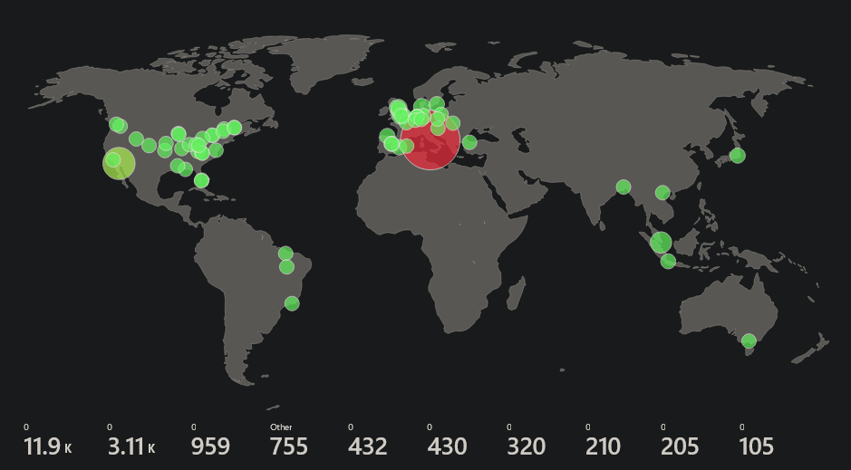
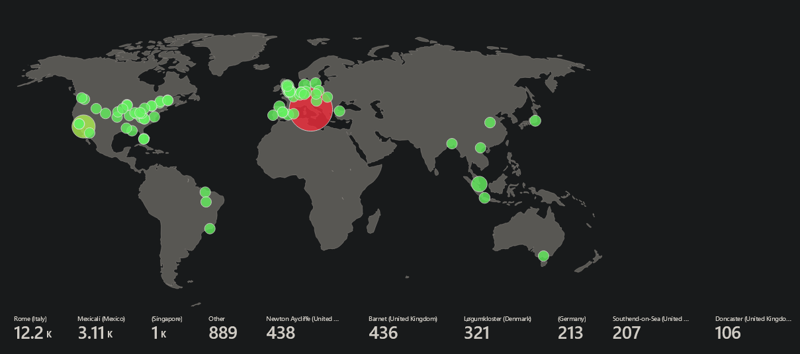

# Azure SOC Honeypot Project

recently, i've been interested in getting into SOC work, so i decided to work on something small, basic, but still pretty significant in terms of progress to get used to a mixture of things; specifically Microsoft Azure and SIEMs (in this case, Microsoft Sentinel).

the project in particular is a 'honeypot' of sorts; specifically, to monitor login attempts made on a virtual machine, and to see where they're coming from.

## Section 1: making a microsoft azure account

if it's your first time making a Microsoft Azure account, you can get a free trial for 30 days, giving you about $200 worth of credits to use within those 30 days, and no charge to your credit card (with the exception of a like $1 authorization charge that gets reversed). this works just fine for something like this, since you don't really need to do too much or even 'pay' too much for something like this.

obviously, you'll need a proper name, address, debit card (not prepaid), phone number (for verification), etc. to do this, but once you've done it, it's done.

## section 2: setting up your initial environment

we're aiming to setup 5 things to 'prime' our working environment for this project;

- a resource group
- a virtual network (and network security group)
- a virtual machine
- a log analytics workspace
- a microsoft sentinel instance (you get a 31 day free trial for this)

we'll set the first 3 right now, and setup the last 2 in a bit. head to the dashboard, then proceed onwards with what's ahead.

### resource group

making a resouce group in particular doesn't require anything super specific; however, i'd pick a region that you'll consistently use for *everything* across the course of this project. i went with (US) East US for this, but you can probably use whatever area works for you; just make sure every other deployment you make after this uses the same region you use here.

in addition, while it doesn't *super* matter, i'd suggest picking a familiar name prefix/suffix that pairs along with all the other instances you deploy; for the resource group, i named it `SOC-resourcegroup`.

don't bother with making any kind of tags for this, or anything else from here; the tags system has its reasons for existing, but it's irrelevant here/for this project.

### virtual network

with every other thing you deploy from here on out, including this, make sure it's within the resource group we just created (which, in this case, would be `SOC-resourcegroup`).

for the instance details, use a similar naming premise for like with the resource group; i named it `SOC-vnet`. make sure the region still matches with your resource group.

disable any security options if they're checked; none will be necessary for our honeypot.

the default settings for IP addresses should be fine; assuming this is based on a fresh project. there should be no conflicts with anything that already exists.

once you've got everything set, create the virtual network. this might take a moment, so give it a bit.

### virtual machine

i chose to create a virtual machine from 'scratch' for this; i'm sure the preset configurations would work fine for this, but i preferred having a bit more freedom when making it.

#### for the Basics tab...

make sure your resource group and region match up correctly; it should still be the ones we set before.

for the virtual machine's name, i chose to name it something 'believably' real; while i don't believe it actually matters in the long run, i named mine `WORK-NET-US-EAST`.

while the size doesn't super matter price-wise for a free trial (you only get $200 in credits for a month, anyhow), i stuck with `Standard_D2s_v3` for this project. you might be able to get away with `Standard_DS1_v2` since it's not super complex, but i didn't bother trying it.

you can leave most other settings alone; however, you should change the Image (which is the operating system) from whatever it's set to currently, to `Windows 10 Pro, version 22H2`. partly because it's the easiest to work with, and partly because i just prefer using Windows 10 over Windows 11; especially for something like this (given the upcoming end of service date for it, it'd also be more 'vulnerable').

in addition, you should also set the user:pw for the administrator account to something secure and random, just so anyone can't, y'know, actually log in normally, but do this so you can get more attempts on your system. **don't forget this; write it down/save it somewhere!**

leave the RDP port open to the internet if it isn't already (it should be, normally?); we'll use this to connect, if only for a short moment, and change settings on the virtual machine when it's up & running.

#### for the Disks tab...

you really shouldn't have to change anything here, but make sure `Delete with VM` is checked if it isn't. it should be, ideally.

#### for the Networking tab...

set the virtual network to the virtual network we just made (which in this case, is `SOC-vnet`), and create a new public IP for the machine. the only other thing you should do here aside from that is make sure `Delete NIC when VM is deleted` is checked (and make sure RDP is still being allowed as a public inbound port).

#### for the Management tab...

you can/should enable Microsoft Defender for Cloud here; while we're opening our machine to the open internet on purpose, we'd still like some form of security beyond that.

once you've done *all* that, you can skip the other tabs (Monitoring, Advanced, Tags) and create the virtual machine. this will take a small bit of time to deploy, so take a small break while it manifests itself. once it's done, we can get started on the next step...

## section 3: setting up the VM

our goal is to open the VM up to the internet, so we can see attacks made on it; opening RDP is a good step, but we'll have to do a bit more work to have it open completely.

### on the VM side/remote desktop connection

for this, i'm assuming you're running on a version of Windows that has Remote Desktop Connection; if not, you'll need to find another way to connect. for linux systems, you can use [Remmina](https://remmina.org/). for macOS, there's microsoft's official Remote Desktop client (renamed to `Windows App`) on the [App Store](https://apps.apple.com/us/app/windows-app/id1295203466). you'll have to find instructions for setting it up for your particular OS on your own; the following instructions are for Windows in particular.

in Azure, get your virtual machine's public IP; it'll be listed on the virtual machine's page (you can get to it from Azure's dashboard) under Networking. copy it.

open up Remote Desktop Connection, and paste in the IP. if the machine is configured correctly from earlier, you should receive a login prompt; enter the username and password from earlier (i sure hope you wrote it down, or remembered it! if not, you'll need to reset it (it's under `Help` -> `Reset password` in the virtual machine page's sidebar).

if it's correct, you'll login to the virtual machine and (probably) be met with windows 10's usual analytics setup screen. i chose to just disable everything; you can probably just ignore it.

once you reach the desktop, open up the Run dialog (Win+R) and run `wf.msc` (Windows Defender Firewall with Advanced Security); this should open up the program mentioned in name here.

in the main window, click on `Windows Defender Firewall Properties` to open the properties window, then under `Domain Profile`, `Private Profile` and `Public Profile`, change the `Firewall state` to `Off`, and apply the changes; this will stop blocking requests using Inbound/Outbound rules no matter the profile. that's one step of what we need to fully open the machine to the internet.

when you're done, you can close the firewall window, and log out of the VM. we won't need to do anything else on the machine itself from this point forward.

### on the Azure side/network security group configuration

on Azure's dashboard, alongside your VM, you should see a `Network security group` that has the same name as your VM, with the prefix of `-nsg`. open it up, as we're going to make one last change to open up the machine to the internet.

first, delete the existing inbound security rule that opens RDP to the internet, as it'll be redundant to have for what we're about to make. (we're already logged out, so removing it shouldn't matter).

then, in the sidebar, go to Inbound security rules, then click Add at the topleft to make a new rule.

by default, most of the settings here should be fine; however, under `Destination port ranges`, change it from `8080` to `*` -- this will wildcard *all* ports, accepting any connections made to the system regardless of port. obviously, you should *never* do this on any system you care about, but in this case, this is exactly what we want.

set the name to something that makes it very clear what this rule does; personally, i set mine to `VERYBAD__LetsJustRuinEverything` for fun -- a sane person would set it to something along the lines of `DANGER__AllowAllPortsInbound`. you shouldn't have to touch the priority, but having at 100 would make it the most prioritzed rule on a default network security group.

add the rule, and we're basically done opening the virtual machine to the internet; anything can connect to this now. how horrible (good)!

### section 4: microsoft sentinel setup

to actually monitor attempts made to login to our system, we need to make both a log analytics workspace (LAW), enable microsoft sentinel, and configure both properly.

let's start with the LAW. it likely won't appear in the sidebar or dashboard, so search for `Log Analytics workspaces` in the searchbar above; click the reuslt that matches.

like with other things we've made, make sure resource group and region matches with the others (there might be a separate resource group made labeled `NetworkWatcherRG`; ignore it, and set it to the resource group you made).

for the name, i chose the name `analogger-SOC-0000`; you can probably choose something less goofy but still along the lines of what we've named things before.

ignoring tags, you can create it. this will take a small bit of time; we'll need it for the next step, so let it fully deploy.

once we've done that, we can set up Microsoft Sentinel. search for `Microsoft Sentinel` in the top-most search bar, then click it when it appears. on its page, you'll be given an option to add it to a workspace; if it's ready, it should be the one we just made. if it's not there yet, give it a bit, then click Refresh until it appears. when it's made, click on it, then click Add to properly add it.

when it's done, you'll be given a new page to look at. on the sidebar, expand Content management, then go to Content hub. search for `Windows Security Events` in the hub; it should appear named exactly that. click on it, then on the right, click Install to install the full solution to your workspace. it'll take a small bit, but once it's done, there's just one thing we need to do to properly link up Microsoft Sentinel to our VM and get to logging.

when Windows Security Events is installed, click on Manage. this should take you to a new page with extra options to configure; the one we're interested in is Windows Security Events via AMA -- click on it, then on the space to the right, click on Open connector page. then, from here, click Create data connection rule.

name the connection rule something along the lines of `login-attempt-watcher-win`. make sure it's in the same resource group as your other deployed objects/your VM.

under Resources, you can just check your entire Azure subscription if you've followed everything thus far; however, if you want to do this on a specific VM, open up each category (Azure subscription, your resource group, etc.) until you see the VM you want, then enable it.

under Collect, you can change the event type to stream from All Security Events  to Common; it's not necessary, but we really don't need *everything*.

when everything's configured, create the data collection rule. it will take some time for it to properly sync up with your VM and fully create itself. to check progress, you can head to your virtual machine's page, and under Settings -> Extensions + applications in the sidebar, you can watch the status of the agent it installed for this purpose to see if it's ready. if it says `Provisioning succeeded`, it's ready for use, and we're ready to log!

### section 5: querying security events

we've got everything setup for being able to view our logs in azure; head over to your logs analytics workspace on the dashboard, then go to Logs in the sidebar.

close out of the queries hub; we're going to do very basic KQL to view security events, just to ensure it works.

change the mode at the top-right from Simple mode to KQL mode. in the query/text field that appears, type SecurityEvent, then click Run. this will go through logs and parse every security event the data collector can parse, and create a table of everything. by default, this is set to only show the most recent 1000 events from the last 24 hours.

you won't see much, initially; it'll likely only show your most recent logins, alongside miscellaneous other events. it'll take time to actually show fresh attempts made on your system; this can take a while -- for me, it took about an hour to start seeing login attempts being made. this isn't important right now -- we just needed to see it working.

this can be refined further to get down the specifics of what you're looking for; for example, if you only want to look for failed login attempts (which is what we're looking for), the following KQL query can refine the result to only grab those specifically, along with reorganizing the table for specific information desired;

```
SecurityEvent
| where EventID == 4625
| where TimeGenerated > ago(24h)
| project TimeGenerated, Account, Computer, IpAddress
```

this will query & create a table that only shows the time a failed login attempt happened, the account name it tried to use, the computer/VM it tried to access, and the IP address of whoever/whatever tried to make the login attempt.

the IP addresses are important, because in the next step, we'll actually be using these to (very roughly) geolocate the origin of the IP, and create a heatmap out of them.

for now, though, if you don't see anything, give it a while; wait a few hours, click the Run button again to see if you've got any fresh attempts. when you do, move onto the next section.

## section 6: geoIP & heatmaps

we've got the information/IPs we need; now, we can use them to find a rough location of where they are. but first, we'll need to import the data so we can actually visibly see it.

#### setting up geoIP data/adding a geoIP db

in azure's dashboard, go to Microsoft Sentinel and the instance of it you've attached to your workgroup (if Microsoft Sentinel isn't there, search it at the top again). once it's open, on the sidebar, under Configuration, go to Watchlist.

create a new watchlist; for the name and alias, name it `geoip`, or whatever else you'd like. keep in mind that for later purposes, this name is ~cAsE sEnSiTiVe~!

under source, you'll be given a choice to upload a csv with a header. this is where we'll upload the data needed for geoIP data; but we don't have that data!
you can grab the relevant .csv required from [here](https://github.com/joshmadakor1/Cyber-Course-v2/blob/main/Sentinel-Maps(JSON)/geoip-summarized.csv).

once you have the .csv downloaded, drag & drop/upload it to the page. when it's done, for the SearchKey, set it to `network`. with that configured, create the watchlist.

the process of setting this up can take a very, very long time. by the end of it, your watchlist will have roughly 55k items, as the .csv has 54804 rows of data. you can click on the watchlist and it expand it out from the right to see how the upload progress is going; again, this will probably take many minutes, so take a break & do something else while it uploads.

when it is finally finished, you can head back to the query page on your log analytics workshop to give it a test.

try running the following KQL query (if there's no text box, remember to change it from Simple mode to KQL mode);

```
let geoIPDB = _GetWatchlist("[watchlistname]");
let WindowsEvents = SecurityEvent
	| where EventID == 4625
    | order by TimeGenerated desc
    | evaluate ipv4_lookup(geoIPDB, IpAddress, network);
WindowsEvents
| project TimeGenerated, Account, Computer, AttackingIp = IpAddress, cityname, countryname, latitude, longitude
```

replacing `[watchlistname]` with your geoIP watchlist name, this should take similar results we had earlier; but in addition to the IP (which we have renamed from `IpAddress` to `AttackingIp`), we also get the IP's rough estimation of its city (if it exists), country, longitude and latitude! it's not entirely accurate, but it's good enough for what we wanna do. 

if you'd like, you can export this data into a .csv to look at later; i'd do it when you have a decent amount of data to spare (for instance, waiting after 24 hours), but whenever you do, you can click Share at the top, and export it to a CSV. preferably, i'd use the all columns export option. if you've got a lot of data, make sure to change the time range and how many results are outputted!

with everything setup, we can now make our heatmap!

### making a heatmap from logs

head back to the Azure dashboard, then open Microsoft Sentinel. in the sidebar, under Threat management, go to Workboooks, then click Add Workbook. this will create a basic work book with a lot of basic elements; click edit to actually edit the workbook. you can delete/remove the pre-existing elements by clicking the 3 dots next to it and clicking remove; they're not needed.

click Add, then click Add query; this should add a box with a lot of options. by default, it should have the Data source set as `Log (Analytics)`, the Resource type as `Log Analytics`, and the Log Analytics workspace as your workspace you've set. change it to these, if it isn't set already. you should also change the Time Range to the last 30 days, instead of 24 hours, and change the Visualization to a Map, with a size of Full.

now, in the Query field, copy/paste the following;
```
let geoIPDB = _GetWatchlist("geoIP");
let WindowsEvents = SecurityEvent;
WindowsEvents | where EventID == 4625
| order by TimeGenerated desc
| evaluate ipv4_lookup(geoIPDB, IpAddress, network)
| summarize LoginAttempt = count() by IpAddress, latitude, longitude, cityname, countryname
| project LoginAttempt, AttackingIp = IpAddress, latitude, longitude, city = cityname, country = countryname,
friendly_location = strcat(cityname, " (", countryname, ")");
```

this is very similar to the query shown before, but adds some aditional lines for the purposes of specifically cleaning up and sorting data for the map in particular, including summarizing attempts that match. run the query; you should get a bunch of data on the map, but it doesn't look quite right just yet -- the login labels below the numbers don't make sense!



this is because we still need to change up one of the settings of the map to suit our data; the map settings should have opened to the right to the indicate this, but you can click Map Settings to show the window if it hasn't appeared.

scroll to the bottom; under Metric Settings, you should see an option labeled Metric Label that is set to `None...` -- change it from that, to `friendly_location`, then click Apply. after that, your labels should make a lot more sense!



now, you've got a (mostly) accurate map of everywhere your VM is receiving failed login attempts from; this might be small, at first, especially in the first few hours of your machine being public, but after 24 hours, your map should look a lot like the above! if you'd like, you can change the color palette of your map (Green from Red, by default, works fine, though)

with that, you're basically done -- you've set up a VM to the open internet with a (relatively) secure login, you're actively logging attempts made, and have a good way to visualize it! click 'Done editing' to finalize your changes, click the Save icon (floppy disc), and name the workbook whatever you'd like; and, one last time, make sure it's in the same resource group and location as everything else you've made.

## section 7: finalizations, and closing notes

after this, i had basically done everything i needed/wanted to do. i let it run for a while longer until i had a good collection of data; i took a few screenshots of the map over time, took one final export of the data, then shut off the VM.

from here, you can shut down your VM, delete your work & cancel your azure subscription if you truly don't have any more interest. but just by doing this, you, and myself personally, have gained a lot of experience working with cloud infrastructure/software, and gained a good amount of basic experience working with a SIEM for the first time.

was this an enjoyable project? i'd like to say so! it only took a few hours, resulted in me learning some neat information, and was a fun thing to write about and document. and, it gave me a good amount of experience in something i had only heard about, and never worked with before until now!

i've attached the resulting data (with IPs stripped) of all login attempts made to my VM to this repository; you can glance at it if you're curious!

thanks for reading, and hopefully you enjoyed doing this too, if you walked all the way through this to the end!
